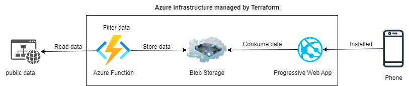
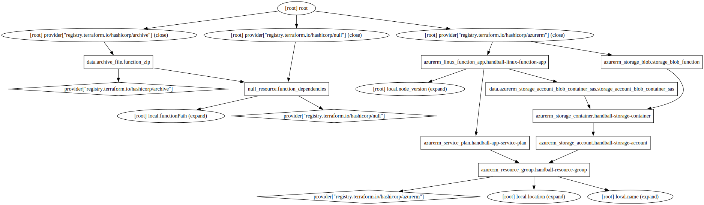
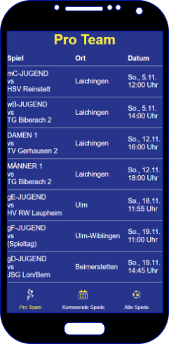

# HandballGamesCollector
Collects and stores the handball games via azure

I need to know the dates of a certain Handball team.
Since I tend to forget to carry the card with all the dates with me this project should query the dates for me and store them in an azure storage.
The idea is, that all of this should happen automatically.
So these steps happen:

1. Terraform creates all the resources in azure
2. An azure function will collect all the dates and store it in a blob container regularly
3. A local Progressive Web App will load that data and display it on my smartphone

So basically like this:

## What terraform creates in detail

## Display the data in a Progressive Wep App

This is a preview how the dummy PWA looks at the moment    

