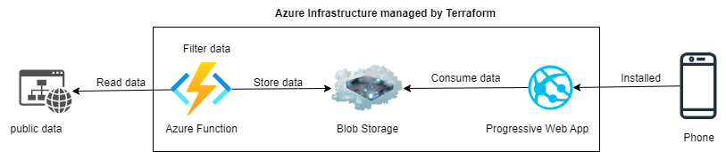
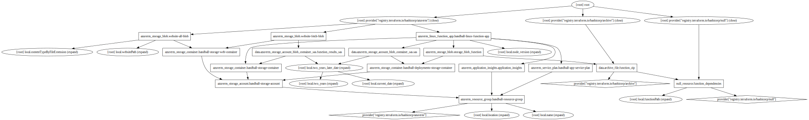
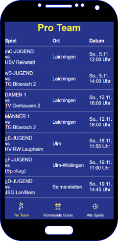

# HandballGamesCollector
Collects and stores the handball games via azure

## Status

## Idea
I need to know the dates of a certain Handball team.
Since I tend to forget to carry the card with all the dates with me this project should query the dates for me and store them in an azure blob storage.
To follow the devops principles all of this should happen automatically.
So these steps happen:

1. Terraform creates all the resources in azure
2. An azure function will collect all the dates, filter them for the team i am interested in and store it in a blob container regularly
3. Terraform will create Shared Access Signatures and place them in html files so that the data can be consumed.
4. A Progressive Web App will be hosted on Azure and display it on my smartphone

So basically like this:

## What terraform creates in detail

## Display the data in a Progressive Wep App

This is a preview how the dummy PWA looks at the moment    

